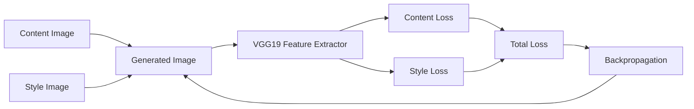
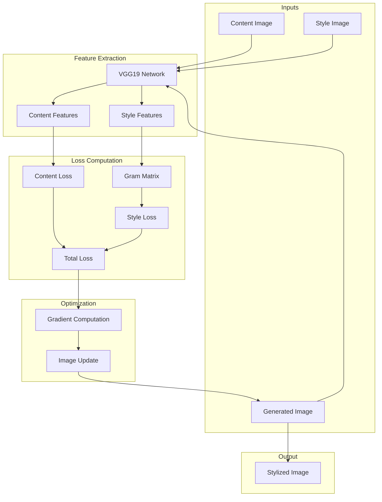

# Neural Style Transfer with VGG19 (TensorFlow/Keras)

A deep learning project that implements Neural Style Transfer using a pre-trained VGG19 network in TensorFlow and Keras. The system generates a new image that preserves the semantic content of one image while adopting the artistic style of another through optimization-based feature matching.

---

## Overview

This repository demonstrates how convolutional neural networks can separate and recombine content and style by leveraging feature representations from pretrained models. The approach is based on iterative optimization of a generated image.

---

## Features

- End-to-end neural style transfer pipeline  
- Content and style representation using CNN features  
- Style extraction via Gram matrix correlations  
- Weighted combination of content and style objectives  
- Gradient-based image optimization  
- Modular and educational implementation  

---

## Model & Framework

- **Model**: VGG19 (pre-trained, feature extractor)  
- **Framework**: TensorFlow 2.x / Keras  
- **Task**: Neural Style Transfer  
- **Input**: Content image + Style image  
- **Output**: Stylized image  

---

## System Architecture

### High-Level Pipeline

## Modular System Design

## Core Components

- **Content Cost**  
  Measures similarity between generated and content image features  

- **Style Cost**  
  Uses Gram matrices to capture texture and style correlations  

- **Total Cost Function**  
  Combines content and style losses  

- **Optimization Loop**  
  Iteratively updates generated image using gradients  

---

## Loss Formulation

### Total Loss

$$
\[
J = \alpha \cdot J_{\text{content}} + \beta \cdot J_{\text{style}}
\]
$$

- Content loss preserves structural information  
- Style loss captures artistic patterns and textures  

---

## Architecture

- VGG19 network without fully connected layers  
- Selected convolutional layers used for feature extraction  

### Style Layers
- block1_conv1  
- block2_conv1  
- block3_conv1  
- block4_conv1  
- block5_conv1  

### Content Layer
- block5_conv4  
